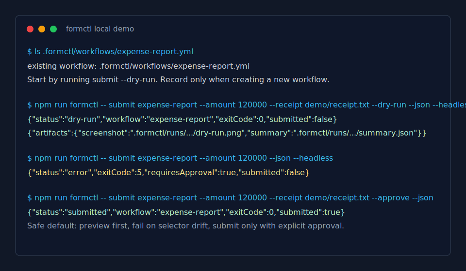
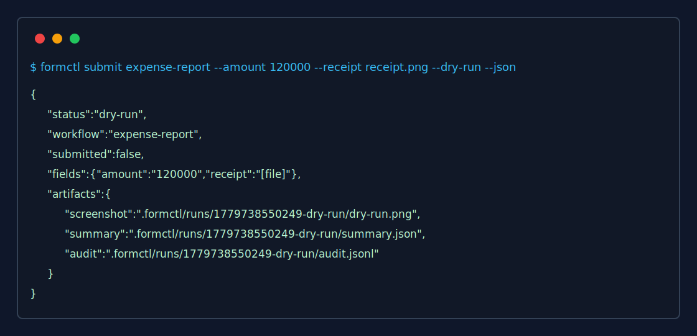
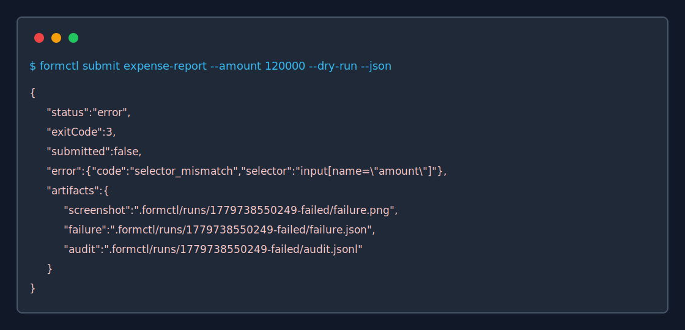
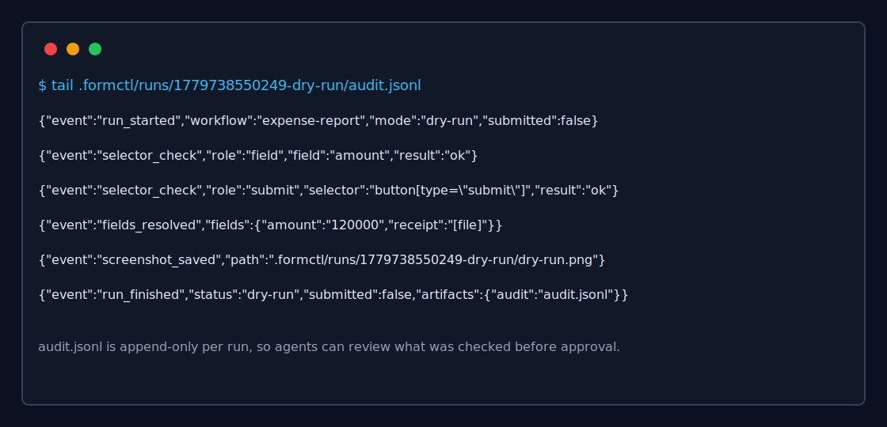

# formctl

formctl turns any browser form into a safe, repeatable CLI command.

Run a saved workflow. Preview first. Approve only when ready.

`formctl` is for developers, operators, and AI agents that need reliable automation for web forms with no useful API. One person records a form workflow into reviewable YAML, then everyone else can run it as a CLI command with dry-run artifacts and explicit approval before real submission.

[Workflow request guide](docs/WORKFLOW_REQUESTS.md) · [Example before/after posts](docs/EXAMPLE_POSTS.md) · [Growth log](docs/GROWTH_LOG.md) · [Trust and security notes](docs/TRUST.md) · [Comparison with Playwright, browser agents, and RPA](docs/COMPARISON.md) · [Why browser agents need form-specific CLIs](docs/WHY_FORM_CLIS.md)

```bash
formctl submit expense-report --amount 120000 --receipt ./receipt.txt --dry-run
formctl submit expense-report --amount 120000 --receipt ./receipt.txt --approve
```



[Watch the 40-second demo video](docs/assets/demo.mp4)

## Trust Artifacts







See [Trust and security notes](docs/TRUST.md) for dry-run, approval, audit log, selector breakage, and secret-handling details. See [Comparison with Playwright, browser agents, and RPA](docs/COMPARISON.md) for when `formctl` is the right layer.

## Install

```bash
npm install -g formctl
npx formctl --version
npx formctl --help
npx formctl doctor
```

`doctor` checks Node, the current workspace, and the Playwright Chromium browser used by record and submit. If the browser is missing, run:

```bash
npx playwright install chromium
```

## Two-Minute Local Demo

Install dependencies:

```bash
npm install
```

Start the local demo form in one terminal:

```bash
npm run demo
```

The demo workflows are already checked in under `.formctl/workflows/`.

Preview a submission without sending the form:

```bash
npm run formctl -- submit expense-report --amount 120000 --receipt demo/receipt.txt --dry-run --json --headless
```

Submit only after explicit approval:

```bash
npm run formctl -- submit expense-report --amount 120000 --receipt demo/receipt.txt --approve --json --headless
```

Interactive submit shows the `dry-run.png` screenshot path before asking you to type `approve`.

Try a second fixture with a select field and checkbox:

```bash
npm run formctl -- submit admin-invite --email ops@example.com --role admin --notify true --dry-run --json --headless
```

Try a support refund fixture with a date input and textarea:

```bash
npm run formctl -- submit support-refund --orderId ORD-1001 --refundDate 2026-05-26 --reason "Duplicate charge" --dry-run --json --headless
```

Try a vendor onboarding fixture with file upload, select, checkbox, date, and notes:

```bash
npm run formctl -- submit vendor-onboarding --legalName "Acme Supplies" --website https://vendor.example --taxForm demo/tax-form.txt --riskTier medium --ndaSigned true --onboardingDate 2026-05-26 --notes "Approved vendor" --dry-run --json --headless
```

Try a procurement approval fixture with an open modal, two visible steps, and a confirmation page:

```bash
npm run formctl -- submit procurement-approval --requestorEmail buyer@example.com --department finance --amount 98000 --neededBy 2026-06-01 --justification "Quarterly laptop refresh" --urgent true --dry-run --json --headless
```

Try a CRM update fixture with a pipeline stage, owner, next contact date, priority flag, and notes:

```bash
npm run formctl -- submit crm-update --accountName "Northwind Traders" --stage renewal --ownerEmail ae@example.com --nextContactDate 2026-06-03 --priority true --notes "Renewal risk flagged" --dry-run --json --headless
```

Try a compliance attestation fixture with a control area, attestation date, checkbox, and notes:

```bash
npm run formctl -- submit compliance-attestation --employeeEmail auditor@example.com --controlArea security --attestationDate 2026-06-15 --compliant true --notes "Quarterly access review complete" --dry-run --json --headless
```

Run artifacts are written under `.formctl/runs/<run-id>/`:

- `summary.json`
- `audit.jsonl`
- `dry-run.png` for previews
- `post-submit.png` for approved submissions
- `failure.json` and `failure.png` for selector mismatches

Audit logs record selector checks, redacted field values, approval source, screenshots, and final result.

## Create A New Workflow

Use `record` only when you need to create a workflow that does not exist yet.

```bash
formctl record expense-report https://example.internal/expense
```

Commit or share the generated `.formctl/workflows/<workflow-name>.yml` file so other users can start from `submit --dry-run`.
`record` also saves a baseline screenshot next to the workflow file.

## Commands

```bash
formctl submit <workflow-name> --dry-run [flags]
formctl submit <workflow-name> --approve [flags]
formctl submit <workflow-name> [flags]
formctl inspect <workflow-name> [--json]
formctl record <workflow-name> <url>
formctl doctor [--json]
```

## Browser mode defaults

- `record` defaults to `--headed` so humans can watch login and form discovery.
- `submit --dry-run` defaults to `--headless` for repeatable agent and CI previews.
- Use `--headed` or `--headless` to override the default for any browser-backed command.

Workflow files are stored at:

```text
.formctl/workflows/<workflow-name>.yml
```

## Safety Contract

- Dry-run never clicks the recorded submit selector.
- Real submission requires `--approve` or an interactive terminal confirmation.
- Recorded selectors must match exactly one element.
- Missing or ambiguous selectors fail before filling fields or submitting.
  Selector mismatch failures write `failure.json`, `failure.png`, and `audit.jsonl` without filling or submitting the form.
- File inputs are redacted as `[file]` in summaries.
- Audit logs are written for successful dry-run, approved, and selector-mismatch failed runs.
- JSON output is available for agent and automation callers.

## Exit codes

```text
0 success
1 user/input error
2 workflow not found
3 selector mismatch
4 dry-run failed
5 approval required
10 unexpected runtime error
```

## Agent Usage

Agents should call `submit --dry-run --json` first, inspect the returned artifacts, and only use `--approve` when the user or policy explicitly allows submission.

See the [Agent safety guide](docs/agents.md) for Codex, Claude Code, Cursor, Copilot CLI, and other coding agents.

See [Why browser agents need form-specific CLIs](docs/WHY_FORM_CLIS.md) for JSON branching examples and the agent-specific rationale. See the [MCP setup guide](docs/MCP.md) for local-checkout and npm-based client configuration.

## MCP Server

`formctl-mcp` exposes the dry-run-safe parts of the CLI to MCP clients:

```bash
npx formctl-mcp
```

Tools:

- `formctl_doctor`
- `formctl_inspect`
- `formctl_submit_dry_run`

The MCP server does not expose approved submit. Agents still need a human or policy-approved CLI call to run `formctl submit ... --approve`.

Approval-required JSON looks like:

```json
{
  "status": "error",
  "workflow": "expense-report",
  "exitCode": 5,
  "submitted": false,
  "requiresApproval": true,
  "error": {
    "code": "approval_required",
    "message": "Approval required: run with --dry-run to preview or --approve to submit."
  }
}
```

## Current Scope

This is an early MVP. It currently records named form fields and a submit selector from a live page. It does not yet implement full event-history recording, credential storage, CAPTCHA handling, hosted execution, or selector healing.
